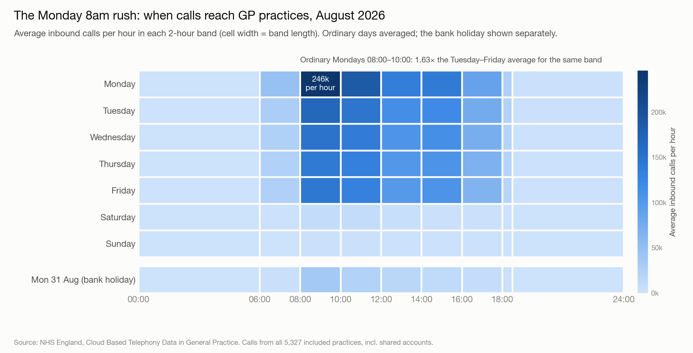
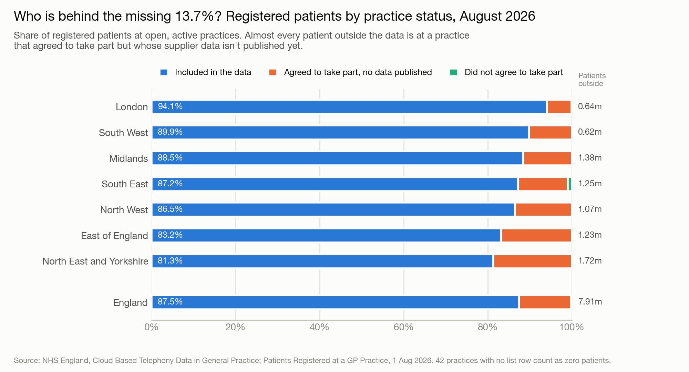
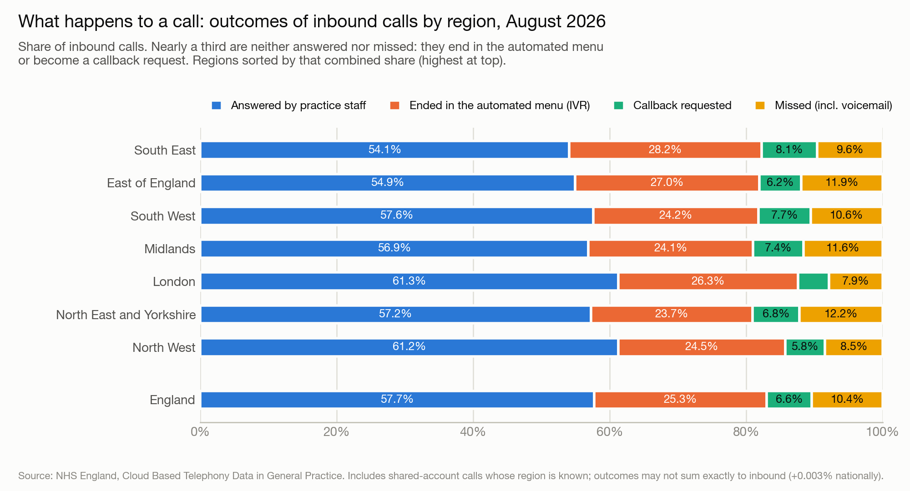
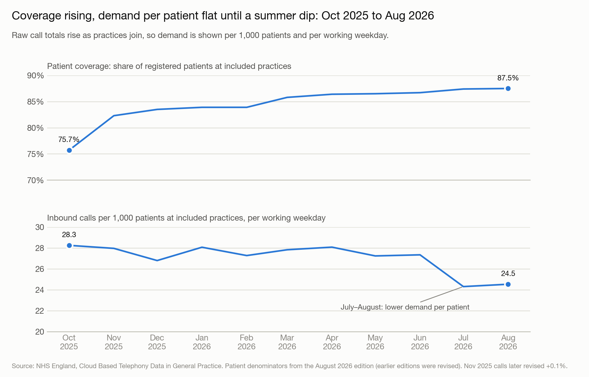

# NHS GP Cloud Based Telephony Pipeline

A Bronze → Silver → Gold medallion pipeline over NHS England's
[Cloud Based Telephony Data in General Practice](https://digital.nhs.uk/data-and-information/publications/statistical/cloud-based-telephony-data-in-general-practice)
(official statistics in development). It covers 11 monthly releases (October 2025 – August
2026), about 77 million rows of practice-by-day call data, joined to registered-list sizes
and the national practice register. That way coverage can be stated as a share of
**patients**, not just practices.

**Key finding:** the headline "2,037,943 calls (7.5%) between 8am and 10am on Monday
mornings" for August 2026 reproduces exactly, but it adds four ordinary Mondays to a bank
holiday. On an ordinary Monday, 491,832 calls arrive between 08:00 and 10:00. That's
**1.63×** the Tuesday–Friday average for the same two hours, and 28.7% of the whole day's
calls.



## The Problem

In August 2026, NHS England reported 27,160,966 calls to 5,327 GP practices (86.3% of open,
active practices): 57.7% answered by practice staff, 10.4% missed. Before treating any of
those rates as national, three things needed checking:

1. **Coverage by patients.** Who sits behind the 13.7% of practices not in the data?
2. **The remainder.** Answered plus missed is only 68.1%. What happens to the other 31.9%?
3. **Monday 08:00–10:00.** Rebuild the published 2,037,943 rather than take it on trust.
   August 2026 had five Mondays, and one of them was the Summer Bank Holiday.

## Data Sources

- **NHS England, Cloud Based Telephony Data in General Practice**: 11 monthly releases,
  practice × day × time band (and × duration / wait-time bucket), plus each month's
  summary workbook and practice participation list
- **NHS England, Patients Registered at a GP Practice**: 1 August 2026 snapshot (practice
  totals and practice → PCN / sub-ICB / ICB / region mapping)
- **ODS `epraccur`**: the national register of GP practices and other prescribing cost
  centres, with columns named from the ODS reference catalogue

Exact files, join keys, indicator definitions and open questions are in
[`docs/sources.md`](docs/sources.md). Every downloaded file is fingerprinted (SHA-256,
source URL, timestamp) in [`evidence/download_manifest_2026-10-02.txt`](evidence/download_manifest_2026-10-02.txt).

## Pipeline Architecture

Bronze → Silver → Gold

| Layer | What it does | Output |
|---|---|---|
| Bronze | Verifies every file against the SHA-256 manifest, saves what each publication page said on the day, writes CSVs to Parquet **unchanged** (all values as text) with lineage columns | 28 Parquet files, 77,095,522 rows; 13 dated page snapshots |
| Silver | Indicator definitions; the shared-phone-account rule; typed call files; practice participation for all 11 months; epraccur named from the ODS spec; published Table 1 / Table 2 parsed from every edition | Typed call tables, practice dimension, published-figure tables |
| Gold | **Reconciliation gate** against NHS England's own August 2026 figures, then the analytical cuts | 7 CSVs in `data/gold/`, 4 charts in `docs/charts/` |

## Reconciliation Gate

Nothing in Gold is derived until NHS England's published figures are rebuilt from the
pipeline. For August 2026, 49 published figures were checked
([`evidence/gold_reconciliation_2026-08.csv`](evidence/gold_reconciliation_2026-08.csv)):

| Status | Count | What it covers |
|---|---|---|
| Exact match | 43 | Practice counts and coverage; inbound calls; all four outcomes; callbacks; every wait-time band (any time, core hours, 8–10am); Table 4b counts; the Monday figure; all 310 date × time-band cells of Table 2 |
| Published label error | 4 | Call-duration percentages. The values are right but printed one row off from the January 2026 edition onward. The published "1 minute or less: 8.3%" is really the over-5-minutes share; the true figure is 22.8% |
| Explained | 2 | Registered-patient totals, 0.03% short. The gap sits entirely in 42 practices with no 1 August list row, almost all services that hold no registered list (walk-in centres, extended-access hubs). Patient coverage still matches at published precision |

Building the gate also turned up:
- Table 1's "Calls answered" uses CBT007 (answered calls by duration), not CBT003 (by wait time). The two differ only in the three months where one practice disagrees.
- **November 2025 was revised upward after publication** (+29,234 inbound, +15,431 answered), but its CSVs were never reissued.
- The headlines treat the bank holiday inconsistently. The Monday 08:00–10:00 figure includes 31 August; the core-hours and 8–10am totals in Table 4b exclude it.

## Key Findings

| Metric | Value |
|---|---|
| Ordinary Monday, 08:00–10:00 | 491,832 calls: **1.63×** the Tue–Fri average; 28.7% of the day's calls |
| Bank holiday share of the published Monday figure | 70,616 of 2,037,943 |
| Registered patients outside the data | 7.91m (12.5%), of whom **7.80m** are at practices that *agreed* to take part but whose data isn't published |
| Patient coverage by region | 81.3% (North East and Yorkshire) to 94.1% (London) |
| The 31.9% neither answered nor missed | 25.3% ended in the automated menu (IVR) + 6.6% callback requests |
| IVR share by region | 23.7% (North East and Yorkshire) to 28.2% (South East) |
| IVR share by practice (middle 80%) | 13.6% to 34.3%. Practice phone set-up, not just demand |
| Calls from shared phone accounts | 1,749,178 (6.4%). Can't be split between practices; 91% can still be placed by region |
| Practices whose outcomes sum exactly to inbound | 98% (Aug 2026), up from about 77% in Oct 2025 |
| Calls per 1,000 patients per working weekday | 27–28 from Oct 2025 to Jun 2026; 24.3–24.5 in Jul–Aug 2026 |







### Caveats that travel with these figures

- **Official statistics in development.** Practices configure their own phone systems, and
  NHS England warns against comparing practices directly.
- **Wait times have a series break in June 2026.** A supplier corrected its wait-time
  method and earlier months weren't restated, so "% answered within 2 minutes" isn't
  like-for-like across that point.
- **Patient denominators for earlier months are revised** in later editions. The trend
  uses the August 2026 edition throughout.
- **Missed calls include voicemail**, which some practices use for prescription requests.
- **The July–August dip** covers only one summer, so it can't yet be separated from
  seasonality.

Full numbers behind every finding are in `notebooks/03_gold.ipynb` and `data/gold/*.csv`.

## Notebooks

| Notebook | Purpose |
|---|---|
| `01_bronze.ipynb` | Manifest verification, page caveats, raw CSVs to Parquet unchanged |
| `02_silver.ipynb` | Definitions, shared-account rule, practice dimension, published-table parsing, data-quality checks |
| `03_gold.ipynb` | Reconciliation gate + the analytical cuts |

`src/pipeline/` holds scripted equivalents of each notebook, plus the downloader and the
chart script.

## Repository Structure

```
nhs-gp-cloud-telephony-pipeline/
├── notebooks/
│   ├── 01_bronze.ipynb
│   ├── 02_silver.ipynb
│   └── 03_gold.ipynb
├── src/pipeline/
│   ├── download_bronze.py      # downloads all sources + SHA-256 manifest
│   ├── bronze_ingest.py
│   ├── silver_build.py
│   ├── gold_build.py
│   └── gold_charts.py          # PNGs in docs/charts/, drawn from data/gold/
├── data/
│   ├── bronze/                 # gitignored except Aug 2026, registered patients, ODS
│   ├── silver/                 # gitignored — regenerate from the notebooks
│   └── gold/                   # committed CSVs
├── evidence/
│   ├── download_manifest_*.txt # SHA-256, URL and timestamp for every file
│   ├── publication_pages/      # dated HTML snapshots + extracted caveat text
│   ├── reference/              # ODS epraccur specification snapshot
│   ├── bronze_inventory.csv
│   ├── silver_*.csv            # join, outcome-sum, duration-label and revision checks
│   └── gold_reconciliation_2026-08.csv
├── docs/
│   ├── sources.md              # files, join keys, definitions, findings, open questions
│   └── charts/
├── requirements.txt
└── README.md
```

## How to Reproduce

```bash
git clone https://github.com/YusufIsmailayo/nhs-gp-cloud-telephony-pipeline.git
cd nhs-gp-cloud-telephony-pipeline
pip install -r requirements.txt
jupyter lab
```

Then run `01_bronze` → `02_silver` → `03_gold` in order. Bronze re-downloads the October
2025 – July 2026 back series (~330 MB, not committed) from the manifest URLs and stops if any
file's SHA-256 doesn't match. To redraw the charts afterwards:

```bash
python src/pipeline/gold_charts.py
```

## Data and Ethics

Published, aggregate NHS England and ODS open data only. The publication contains no
patient-identifiable or clinical information. The data is practice-level and names
practices, but this repo publishes no practice rankings or named-practice comparisons:
NHS England warns that phone-system configuration differs between practices, so a league
table would mislead.

## Author

Yusuf Ismail — Data Engineer | NHS & Public Sector Analytics
[GitHub](https://github.com/YusufIsmailayo) | [Medium](https://medium.com/@yusufismail_91982)
